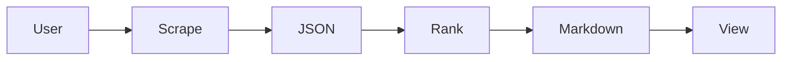

# 🌐 Agentic-Index – The Data-Driven AI-Agent Repository Index

Agentic-Index continuously scores and curates every open-source framework for building autonomous AI agents. Fast search, transparent metrics, zero BS.

We rank everything using a transparent scoring formula based on:

  * 🌟 Stars & momentum
* 🔧 Maintenance & issue health
* 📚 Docs & examples
* 🧠 Ecosystem fit
* 📅 Recency
* ⚖️ Licensing

### Metrics Explained

| Emoji | Field | Formula | Updated | Source |
|-------|-------|---------|---------|--------|
| ⭐ | `stars_30d` | GitHub star Δ (30 days) | Nightly | `scraper/github.py` |
| 🔧 | `maintenance` | Issue/PR hygiene score | Weekly | `score/maintenance.py` |
| 📅 | `release_age` | Days since latest release | Nightly | `scraper/github.py` |
| 📚 | `docs_quality` | Heuristic score (README + examples) | Monthly | `score/docs.py` |
| 🧠 | `ecosystem_fit` | Keyword-based tag affinity | Monthly | `score/ecosystem.py` |
| ⚖️ | `license_score` | OSI compatibility / restrictiveness | Static | `score/license.py` |

Small fluctuations up to ±0.02 are normal between refreshes. See the [📊 Metrics Legend](#metrics-legend) for weighting details. The full JSON schema is documented in [SCHEMA.md](SCHEMA.md).

> **🎯 TL;DR:** This isn’t just a list—it’s your launchpad for building with AI agents.

Want a shortcut? Jump to the [Fast-Start table](FAST_START.md).

-----

<p align="center">


</p>

This catalogue is maintained by the Agentic-Index project and is updated regularly (aiming for monthly refreshes) to reflect the rapidly evolving landscape of Agentic-AI.

-----

## TOC

* [✨ Why Agentic Index is Different](#-why-agentic-index-is-different)
* [🚀 Fast-Start Picks (Curated for Newcomers)](#-fast-start-picks-curated-for-newcomers)
* [⚡ Installation & Quick-start](#-installation--quick-start)
* [🏆 The Agentic-Index Top 50: AI Agent Repositories](#-the-agentic-index-top-50-ai-agent-repositories)
  * [💎 Honourable Mentions / Niche & Novel Gems](#-honourable-mentions--niche--novel-gems)
    * [🔬 Our Methodology & Scoring Explained](#our-methodology--scoring-explained)
    * [🏷️ Category Definitions](#-category-definitions)
  * [🔄 Changelog](#-changelog)
  * [🏗 Architecture](#-architecture)
  * [🔧 Usage](#-usage)
  * [🔄 How refresh works](#-how-refresh-works)
  * [🧪 Testing](#-testing)
  * [🤝 How to Contribute](#-how-to-contribute)
  * [🛡 Code of Conduct](#-code-of-conduct)
  * [📜 License](#-license)

-----
<a id="-why-agentic-index-is-different"></a>

## ✨ Why Agentic Index is Different

In the fast-moving world of Agentic-AI, finding high-quality, actively maintained, and truly impactful frameworks can be a pain. Many lists are subjective or just track stars. Agentic-Index cuts through the noise with an analytical approach:

  * **Systematic Scoring:** Every repo gets crunched through our [transparent scoring formula](#our-methodology--scoring-explained). We look at real signals: community traction (stars [1, 2]), development activity (commit recency [1, 2]), maintenance health (issue management [3, 4]), documentation quality, license permissiveness [1, 2], and ecosystem integration.[1, 5] No black boxes.
  * **Focus on Builder Tools:** We spotlight frameworks, toolkits, and platforms that *actually help you build and orchestrate AI agents*. Check our [scope definition](./docs/methodology.md) for the nitty-gritty.
  * **Relentlessly Fresh:** Data gets a refresh monthly (or sooner if big shifts happen). Stale lists suck. Our [Changelog](./CHANGELOG.md) keeps score.
  * **Automated Vigilance:** A GitHub Action keeps an eye on things weekly, flagging big score or rank changes for review. This keeps the "freshness" promise real.
  * **Open & Transparent:** Our entire [methodology](./docs/methodology.md) – data sources, scoring weights, the lot – is out in the open. Trust through transparency.

Agentic-Index is built to be a reliable, data-driven launchpad for your next Agentic-AI project.
<a id="-installation--quick-start"></a>

## ⚡ Installation & Quick-start

```bash
pip install agentic-index-cli

agentic-index scrape --min-stars 100
agentic-index enrich data/repos.json
agentic-index rank data/repos.json
cat README.md | less         # see table injected
```

-----

<a id="-fast-start-picks-curated-for-newcomers"></a>
## 🚀 Fast-Start Picks (Curated for Newcomers)

New to Agentic-AI or just want the good stuff fast? These repos are top-tier for usability, community, docs, or just plain cool ideas:

  * **CrewAI ([crewAIInc/crewAI](https://github.com/crewAIInc/crewAI))**: Slick orchestration for role-playing, autonomous AI agents. Built for collaborative intelligence. [1]
  * **AutoGen ([microsoft/autogen](https://github.com/microsoft/autogen))**: Microsoft's powerhouse for multi-agent conversational apps. Flexible and robust. [6, 7, 2]
  * **Langchain ([langchain-ai/langchain](https://github.com/langchain-ai/langchain))**: The OG. A massive library for LLM apps with deep agent capabilities and tons of integrations. [8, 9]
  * **AutoGPT ((https://github.com/Significant-Gravitas/AutoGPT))**: One of the first to show off truly autonomous GPT-4, making agentic concepts go viral. [10, 11]
  * **BabyAGI ([yoheinakajima/babyagi](https://github.com/yoheinakajima/babyagi))**: Simple, elegant task management loop that inspired a generation of agent frameworks. [3]
  * **VoltAgent ([VoltAgent/voltagent](https://github.com/VoltAgent/voltagent))**: Clean TypeScript framework for modular AI agent dev, with built-in observability. [12]

-----

<a id="-the-agentic-index-top-50-ai-agent-repositories"></a>
## 🏆 The Agentic-Index Top 50: AI Agent Repositories

The definitive list of Agentic-AI repositories, ranked by the Agentic Index Score. This score is a holistic measure of project quality, activity, and community love.
*(Data updated as of: {timestamp} UTC)*

<!-- TOP50:START -->
| Rank | <abbr title="Overall">📊</abbr> Overall | Repo | <abbr title="Stars gained in last 30 days">⭐ Δ30d</abbr> | <abbr title="Maintenance score">🔧 Maint</abbr> | <abbr title="Last release date">📅 Release</abbr> | <abbr title="Documentation score">📚 Docs</abbr> | <abbr title="Ecosystem fit">🧠 Fit</abbr> | <abbr title="License">⚖️ License</abbr> |
|-----:|------:|------|-------:|-------:|-----------|-------:|-------:|---------|
| 1 | 5.28 | dify | 0 | 0.00 | - | 0.00 | 0.00 | NOASSERTION |
| 2 | 5.17 | langflow | 0 | 0.00 | - | 0.00 | 0.00 | MIT |
| 3 | 5.10 | browser-use | 0 | 0.00 | - | 0.00 | 0.00 | MIT |
| 4 | 5.07 | OpenHands | 0 | 0.00 | - | 0.00 | 0.00 | MIT |
| 5 | 5.06 | lobe-chat | 0 | 0.00 | - | 0.00 | 0.00 | NOASSERTION |
| 6 | 5.05 | MetaGPT | 0 | 0.00 | - | 0.00 | 0.00 | MIT |
| 7 | 5.04 | ragflow | 0 | 0.00 | - | 0.00 | 0.00 | Apache-2.0 |
| 8 | 5.03 | system-prompts-and-models... | 0 | 0.00 | - | 0.00 | 0.00 | GPL-3.0 |
| 9 | 5.02 | LLaMA-Factory | 0 | 0.00 | - | 0.00 | 0.00 | Apache-2.0 |
| 10 | 4.96 | anything-llm | 0 | 0.00 | - | 0.00 | 0.00 | MIT |
| 11 | 4.96 | cline | 0 | 0.00 | - | 0.00 | 0.00 | Apache-2.0 |
| 12 | 4.93 | autogen | 0 | 0.00 | - | 0.00 | 0.00 | CC-BY-4.0 |
| 13 | 4.93 | llama_index | 0 | 0.00 | - | 0.00 | 0.00 | MIT |
| 14 | 4.90 | awesome-llm-apps | 0 | 0.00 | - | 0.00 | 0.00 | Apache-2.0 |
| 15 | 4.87 | Flowise | 0 | 0.00 | - | 0.00 | 0.00 | NOASSERTION |
| 16 | 4.84 | ChatTTS | 0 | 0.00 | - | 0.00 | 0.00 | AGPL-3.0 |
| 17 | 4.84 | mem0 | 0 | 0.00 | - | 0.00 | 0.00 | Apache-2.0 |
| 18 | 4.82 | crewAI | 0 | 0.00 | - | 0.00 | 0.00 | MIT |
| 19 | 4.81 | Langchain-Chatchat | 0 | 0.00 | - | 0.00 | 0.00 | Apache-2.0 |
| 20 | 4.79 | AgentGPT | 0 | 0.00 | - | 0.00 | 0.00 | GPL-3.0 |
| 21 | 4.76 | agno | 0 | 0.00 | - | 0.00 | 0.00 | MPL-2.0 |
| 22 | 4.75 | khoj | 0 | 0.00 | - | 0.00 | 0.00 | AGPL-3.0 |
| 23 | 4.74 | ChatDev | 0 | 0.00 | - | 0.00 | 0.00 | Apache-2.0 |
| 24 | 4.73 | LibreChat | 0 | 0.00 | - | 0.00 | 0.00 | MIT |
| 25 | 4.72 | ai-agents-for-beginners | 0 | 0.00 | - | 0.00 | 0.00 | MIT |
| 26 | 4.72 | cherry-studio | 0 | 0.00 | - | 0.00 | 0.00 | NOASSERTION |
| 27 | 4.72 | Jobs_Applier_AI_Agent_AIHawk | 0 | 0.00 | - | 0.00 | 0.00 | AGPL-3.0 |
| 28 | 4.71 | qlib | 0 | 0.00 | - | 0.00 | 0.00 | MIT |
| 29 | 4.68 | composio | 0 | 0.00 | - | 0.00 | 0.00 | NOASSERTION |
| 30 | 4.66 | FastGPT | 0 | 0.00 | - | 0.00 | 0.00 | NOASSERTION |
| 31 | 4.64 | gpt-researcher | 0 | 0.00 | - | 0.00 | 0.00 | Apache-2.0 |
| 32 | 4.63 | CopilotKit | 0 | 0.00 | - | 0.00 | 0.00 | MIT |
| 33 | 4.63 | haystack | 0 | 0.00 | - | 0.00 | 0.00 | Apache-2.0 |
| 34 | 4.56 | swarm | 0 | 0.00 | - | 0.00 | 0.00 | MIT |
| 35 | 4.55 | agentic | 0 | 0.00 | - | 0.00 | 0.00 | MIT |
| 36 | 4.54 | vanna | 0 | 0.00 | - | 0.00 | 0.00 | MIT |
| 37 | 4.53 | agenticSeek | 0 | 0.00 | - | 0.00 | 0.00 | GPL-3.0 |
| 38 | 4.53 | DB-GPT | 0 | 0.00 | - | 0.00 | 0.00 | MIT |
| 39 | 4.53 | deep-research | 0 | 0.00 | - | 0.00 | 0.00 | MIT |
| 40 | 4.53 | letta | 0 | 0.00 | - | 0.00 | 0.00 | Apache-2.0 |
| 41 | 4.52 | SWE-agent | 0 | 0.00 | - | 0.00 | 0.00 | MIT |
| 42 | 4.51 | eliza | 0 | 0.00 | - | 0.00 | 0.00 | MIT |
| 43 | 4.51 | RagaAI-Catalyst | 0 | 0.00 | - | 0.00 | 0.00 | Apache-2.0 |
| 44 | 4.50 | DocsGPT | 0 | 0.00 | - | 0.00 | 0.00 | MIT |
| 45 | 4.48 | awesome-ai-agents | 0 | 0.00 | - | 0.00 | 0.00 | NOASSERTION |
| 46 | 4.47 | goose | 0 | 0.00 | - | 0.00 | 0.00 | Apache-2.0 |
| 47 | 4.46 | suna | 0 | 0.00 | - | 0.00 | 0.00 | Apache-2.0 |
| 48 | 4.45 | activepieces | 0 | 0.00 | - | 0.00 | 0.00 | NOASSERTION |
| 49 | 4.45 | ai | 0 | 0.00 | - | 0.00 | 0.00 | NOASSERTION |
| 50 | 4.45 | botpress | 0 | 0.00 | - | 0.00 | 0.00 | MIT |
<!-- TOP50:END -->
*➡️ Dig into how these scores are cooked up in our [Methodology section](#our-methodology--scoring-explained) and the [full recipe in /docs/methodology.md](./docs/methodology.md).*

<a id="metrics-legend"></a>

<details>
<summary>📊 Metrics Legend</summary>

- 📊 Score = 0.30*log2(stars+1) + 0.25*recency_factor + 0.20*issue_health + 0.15*doc_completeness + 0.07*license_freedom + 0.03*ecosystem_integration
- ⭐ Δ30d = stars gained in the last 30 days
- 🔧 Maint = 1 / (days_since_last_commit * open_issue_ratio)
- 📅 Release = 1 / days_since_last_release
- 📚 Docs = 1 if README > 300 words & has code else 0
- 🧠 Fit = fraction of ecosystem keywords matched
- ⚖️ License = 1 for permissive, 0.5 for viral, 0 if none

</details>

For a full description of every metric field, see [SCHEMA.md](./docs/SCHEMA.md).

-----

<a id="-honourable-mentions--niche--novel-gems"></a>
## 💎 Honourable Mentions / Niche & Novel Gems

Beyond the top-ranked, these projects are cooking up unique ideas, serving specific niches, or pushing experimental boundaries in Agentic-AI:

  * **[daydreamsai/daydreams](https://github.com/daydreamsai/daydreams)**: 🎯 TypeScript framework for generative agents that live on-chain. AI meets web3. [17, 18]
  * **[fetchai/agents-aea](https://github.com/fetchai/agents-aea) & [valory-xyz/open-aea](https://github.com/valory-xyz/open-aea)**: 🎯 Dedicated frameworks for Autonomous Economic Agents (AEAs) in decentralized systems. [17, 19, 20]
  * **([https://github.com/ReversecLabs/damn-vulnerable-llm-agent](https://github.com/ReversecLabs/damn-vulnerable-llm-agent))**: 🛠️ Learn to break (and fix) ReAct agents. Essential for security-conscious devs. [21]
  * **(https://github.com/video-db/Director)**: 🎯 AI agent framework for serious video magic: search, edit, compile, generate. [17, 22]
  * **[msoedov/agentic\_security](https://github.com/msoedov/agentic_security)**: 🛠️ Open-source vulnerability scanner for Agent Workflows and LLMs. Stay safe out there. [23]

-----
### Our Methodology & Scoring Explained

<a id="our-methodology--scoring-explained"></a>
\<details\>
\<summary\>🔬 Our Methodology & Scoring Explained (Click to Expand)\</summary\>

Agentic-Index believes in full transparency. Here’s the lowdown on how we find, vet, and score repositories.

The core Agentic-Index Scoring Formula:
`Score = 0.30*log2(stars+1) + 0.25*recency_factor + 0.20*issue_health + 0.15*doc_completeness + 0.07*license_freedom + 0.03*ecosystem_integration`\<sup\>†\</sup\>

\<sup\>†\</sup\> *Weights are reviewed and potentially tuned quarterly. Full math and reasoning in [`/docs/methodology.md`](./docs/methodology.md).*

**Quick Look at Components:**

  * **Seed Discovery:** GitHub searches (e.g., `"agent framework"`, `"LLM agent"`), topic filters (e.g., `topic:agent` [17]), and crawling curated lists [24, 25, 7] to cast a wide net.
  * **Metadata Harvest:** Pulling key data: stars, forks, open/closed issues, commit dates, language, license, README snippets. (Examples: [13, 1, 12, 26, 23, 2, 10, 8, 3, 14, 15, 16, 19, 22, 27, 28] and many others as detailed in `docs/methodology.md`)
  * **Quality & Activity Scoring:** The formula balances community buzz, dev activity, maintenance, docs, license, and how well it plays with others.
  * **De-duplication & Categorisation:** Forks usually get skipped unless they’re their own thing now. Repos get bucketed by their main gig.

For the full, unabridged version, see **[./docs/methodology.md](./docs/methodology.md)**.

\</details\>

-----

<a id="-category-definitions"></a>
## 🏷️ Category Definitions

Quick guide to our categories (and the icons you'll see in the table):

  * 🌐 **General-purpose:** Flexible frameworks for all sorts of agentic tasks (e.g., Langchain [8]).
  * 🤖 **Multi-Agent Coordination:** For orchestrating teams of collaborating agents (e.g., CrewAI [1]).
  * 📚 **RAG-centric:** Focused on agents that are wizards at Retrieval-Augmented Generation (e.g., AutoAgent's Agentic-RAG [29]).
  * 🎯 **Domain-Specific:** Tools built for specific industries or tasks (e.g., `video-db/Director` [22]).
  * 🛠️ **DevTools:** Libraries and platforms to help you build, test, deploy, or secure agents (e.g., `msoedov/agentic_security` [23]).
  * 🧪 **Experimental:** Bleeding-edge, research-heavy, or early-stage projects (e.g., BabyAGI [3]).

-----

<a id="-changelog"></a>
## 🔄 Changelog

This isn't a static list. It's alive\! See [CHANGELOG.md](./CHANGELOG.md) for all the adds, drops, and major rank shuffles.

-----

<a id="-architecture"></a>
## 🏗 Architecture



-----

<a id="-usage"></a>
## 🔧 Usage

Run the indexer to fetch fresh repo data:

```bash
python -m agentic_index_cli.agentic_index --min-stars 50 --iterations 1 --output data
```

Generated tables live in the `data/` directory.

<a id="-how-refresh-works"></a>
## 🔄 How refresh works

A scheduled GitHub Action keeps the index up to date. It runs the scraper and
ranker, opens a pull request with any changes, and can auto-merge when all
checks pass. You can also trigger this process manually by running
[`scripts/trigger_refresh.sh`](scripts/trigger_refresh.sh).

<a id="-testing"></a>
## 🧪 Testing

This project uses `pytest` for unit tests and [pa11y](https://github.com/pa11y/pa11y) for accessibility checks. Ensure Chrome is installed before running pa11y:

```bash
# via puppeteer
npx puppeteer browsers install chrome
# or with apt
sudo apt-get install -y chromium
```

Run tests with:

```bash
pytest -q
```

CI runs tests with network access disabled. Set `CI_OFFLINE=1` or run
`pytest --disable-socket` locally to replicate the offline environment.

To check accessibility after building the site:

```bash
npx pa11y web/index.html
```

You can also run `./scripts/install_pa11y_deps.sh` to install pa11y and Chrome.

## 💻 Developer

To trigger a data refresh via GitHub Actions, run:

```bash
bash scripts/trigger_refresh.sh 75
```

Replace `75` with your desired minimum star count. The script requires the GitHub CLI and an authenticated token.
Set a personal access token via the `GITHUB_TOKEN_REPO_STATS` environment variable to avoid hitting rate limits when scraping.

-----

<a id="-how-to-contribute"></a>
## 🤝 How to Contribute

Agentic-Index aims to be *the* spot for Agentic-AI frameworks. Your brainpower and suggestions are gold.

Check out [CONTRIBUTING.md](./CONTRIBUTING.md) for how to:

  * Nominate new repositories.
  * Flag outdated info or errors.
  * Suggest tweaks to scoring or categories.
  * Understand what makes a repo eligible.
  * Install [Git LFS](https://git-lfs.github.com/) and run `git lfs install`.
    PNG and GIF assets are tracked via LFS.
  * Set up your dev environment with [DEVELOPMENT.md](./docs/DEVELOPMENT.md).

For tips on keeping your branch in sync with `main` and resolving conflicts, see
[CONFLICT_RESOLUTION.md](./docs/CONFLICT_RESOLUTION.md).

Let's build the best damn agent list together\!


-----
<a id="-code-of-conduct"></a>
## 🛡 Code of Conduct

Please see our [Code of Conduct](./CODE_OF_CONDUCT.md) for contributor expectations.


<a id="-license"></a>
## 📜 License

The content of Agentic-Index (this `README.md`, files in `/docs/`, etc.) is licensed under([https://creativecommons.org/licenses/by-sa/4.0/](https://creativecommons.org/licenses/by-sa/4.0/)).

Any scripts or code for analysis and generation (e.g., in `/scripts`, if we add 'em) are licensed under([https://opensource.org/licenses/MIT](https://opensource.org/licenses/MIT)).

© 2025 Agentic-Index Maintainers


  
