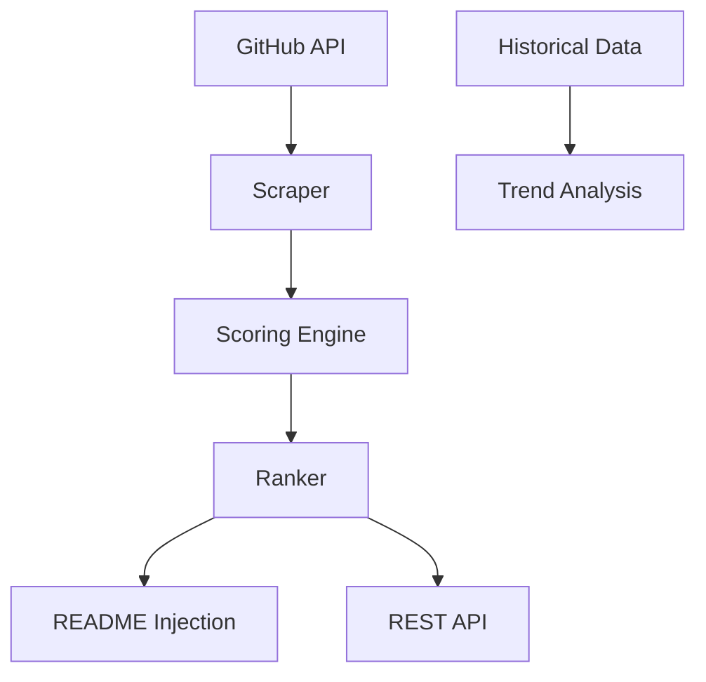
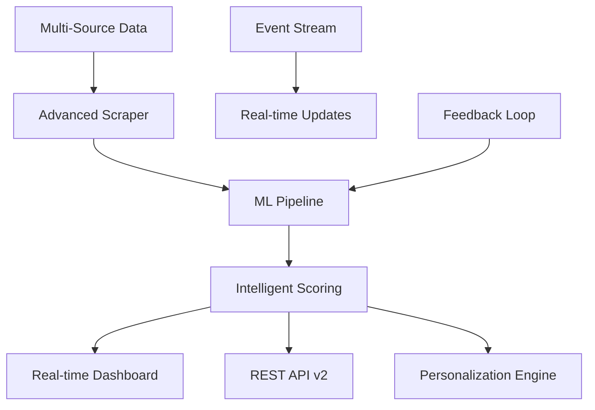
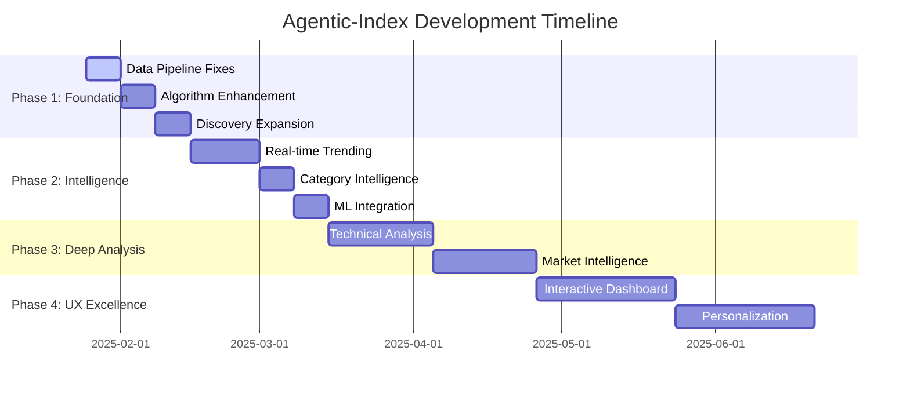

# 🗺️ Agentic-Index Roadmap

<div align="center">

**Building the definitive intelligence layer for the autonomous AI agent ecosystem**

[](https://github.com/adrianwedd/Agentic-Index/blob/main/ROADMAP.md)
[](#)
[](#)

</div>

---

## 🎯 Vision & Mission

### **Our Vision**
Transform how developers discover, evaluate, and adopt autonomous AI agent frameworks through data-driven intelligence and transparent, objective ranking systems.

### **Our Mission**
- **🔍 Comprehensive Discovery**: Continuously scan and catalog the rapidly evolving AI agent ecosystem
- **📊 Intelligent Ranking**: Apply sophisticated, transparent algorithms to surface the highest-quality frameworks
- **📈 Trend Analysis**: Provide actionable insights into ecosystem evolution and emerging patterns  
- **🤝 Community Value**: Serve developers, researchers, and organizations building autonomous AI systems

---

## 📊 Current State Assessment

<table>
<tr>
<td width="50%">

### ✅ **Achievements** 
- **283 repositories** actively tracked and scored
- **Transparent scoring algorithm** with 6 key factors
- **Automated data pipeline** with daily GitHub Actions
- **Beautiful trend visualizations** with historical analysis
- **Category-based organization** (5 major categories)
- **REST API** for programmatic access
- **CSV exports** for external analysis

</td>
<td width="50%">

### 🚧 **Current Limitations**
- **Limited search scope** (4 basic queries)
- **Simple scoring algorithm** lacks nuance
- **Shallow historical data** (5 snapshots over 18 months)
- **Missing Δ Stars data** in user-facing tables
- **No real-time trending** analysis
- **Basic discovery strategy** misses emerging repos
- **Limited community engagement** metrics

</td>
</tr>
</table>

---

## 🚀 Development Phases

### **🎯 Phase 1: Foundation Excellence** 
*Timeline: 2-3 weeks | Priority: Critical*

<details>
<summary><b>📋 Core Infrastructure Fixes</b></summary>

#### **1.1 Data Pipeline Reliability**
- [ ] **Fix Δ Stars Data Pipeline** 
  - Unify star delta calculation between scraper and enricher
  - Resolve `stars_7d` vs `stars_delta` field mismatch
  - Ensure trend data appears correctly in README tables
  - **Impact**: ⭐ Users see functional trend data
  
- [ ] **Enhanced Data Retention**
  - ✅ Increased retention from 7 days to 365 days
  - [ ] Implement data validation and schema consistency
  - [ ] Add automated backup and recovery systems
  - **Impact**: 📈 Rich historical trend analysis

#### **1.2 Algorithm Sophistication** 
- [ ] **Multi-Dimensional Popularity Scoring**
  ```
  Current: log2(stars) * 0.30
  Enhanced: (stars + forks*0.3 + watchers*0.1) with velocity boost
  ```
  - **Impact**: 🎯 More accurate popularity assessment

- [ ] **Advanced Maintenance Health**
  - Issue resolution rate analysis
  - Pull request merge patterns
  - Contributor diversity scoring
  - Release cadence evaluation
  - **Impact**: 🔧 Better maintenance quality detection

- [ ] **Intelligent Documentation Scoring**
  - README structure analysis (headers, examples, badges)
  - API documentation presence detection
  - Tutorial and example quality assessment
  - **Impact**: 📚 Rewards comprehensive documentation

#### **1.3 Discovery Enhancement**
- [ ] **Expanded Search Queries** (4 → 40+ queries)
  - Framework-specific: `langchain agent`, `autogen agent`, `crewai`
  - Technology-specific: `RAG framework`, `vector database`, `prompt engineering`
  - Domain-specific: `finance ai agent`, `healthcare ai`, `coding assistant`
  - Language-specific: `python ai agent`, `rust ai framework`, `go llm agent`
  - **Impact**: 📡 2-3x more repository coverage

- [ ] **Topic-Based Discovery**
  - GitHub topics integration (`topic:artificial-intelligence`, `topic:llm`)
  - Organization-based discovery (known AI companies/orgs)
  - Dependency network analysis (repos using key AI libraries)
  - **Impact**: 🕸️ Comprehensive ecosystem mapping

</details>

<details>
<summary><b>📈 Success Metrics - Phase 1</b></summary>

| Metric | Current | Target | Timeline |
|--------|---------|--------|----------|
| Tracked Repositories | 283 | 500+ | 3 weeks |
| Search Query Coverage | 4 queries | 40+ queries | 2 weeks |
| Historical Data Points | 5 snapshots | 30+ daily snapshots | Ongoing |
| Trend Data Accuracy | 0% (broken) | 95%+ | 1 week |
| Algorithm Factors | 6 basic | 12+ sophisticated | 2 weeks |

</details>

---

### **⚡ Phase 2: Intelligence Amplification**
*Timeline: 3-4 weeks | Priority: High*

<details>
<summary><b>🧠 Advanced Analytics</b></summary>

#### **2.1 Real-Time Trending System**
- [ ] **Velocity Tracking**
  - Stars per day, forks per day, commit frequency
  - Issue creation vs resolution rates  
  - Community engagement patterns
  - **Impact**: 📊 Identify momentum shifts in real-time

- [ ] **Momentum Scoring Algorithm**
  ```python
  momentum_score = (
      star_velocity * 0.4 +
      fork_velocity * 0.2 +
      commit_frequency * 0.2 +
      community_engagement * 0.2
  )
  ```
  - **Impact**: 🚀 Surface rapidly growing repositories

#### **2.2 Category-Specific Intelligence**
- [ ] **Adaptive Scoring by Category**
  - **RAG-centric**: Documentation 25% → 35%, Integration 3% → 15%
  - **Multi-Agent**: Code Quality 20% → 30%, Complexity Handling +10%
  - **DevTools**: Usability +15%, Integration 3% → 20%
  - **Experimental**: Innovation +20%, Recency 25% → 35%
  - **Impact**: 🎯 More relevant rankings per use case

#### **2.3 Community Health Analytics**
- [ ] **Discussion Activity Tracking**
  - GitHub Discussions participation rates
  - Issue response time analysis
  - Community size and growth patterns
  - **Impact**: 👥 Reward active, healthy communities

- [ ] **External Reference Analysis**
  - Blog mentions and tutorial coverage
  - Stack Overflow question/answer activity  
  - Social media presence and engagement
  - Conference presentation tracking
  - **Impact**: 🌐 Capture broader ecosystem influence

</details>

<details>
<summary><b>🤖 Machine Learning Integration</b></summary>

#### **2.4 Predictive Quality Models**
- [ ] **Repository Quality Prediction**
  - Train ML models on historical success patterns
  - Feature engineering from code metrics, community health
  - Confidence scoring for predictions
  - **Impact**: 🔮 Identify high-potential repos early

- [ ] **Similarity-Based Recommendations**
  - Vector embeddings of repository characteristics
  - Clustering analysis for category refinement
  - Automated similar-project discovery
  - **Impact**: 🔗 Better related repository suggestions

</details>

---

### **🌟 Phase 3: Ecosystem Intelligence**
*Timeline: 4-6 weeks | Priority: Medium*

<details>
<summary><b>🏗️ Deep Technical Analysis</b></summary>

#### **3.1 Technology Stack Intelligence**
- [ ] **Dependency Health Analysis**
  - Security vulnerability scanning
  - Dependency freshness and maintenance status
  - License compatibility assessment
  - **Impact**: ⚡ Highlight technically robust repositories

- [ ] **Architecture Pattern Recognition**
  - Plugin system analysis
  - API design pattern detection
  - Integration pathway mapping
  - **Impact**: 🏛️ Architectural insights for developers

#### **3.2 Code Quality Deep Dive**
- [ ] **Automated Quality Assessment**
  - Test coverage analysis (via CI/CD indicators)
  - Code complexity scoring
  - Documentation completeness audit
  - **Impact**: 🔍 Objective code quality metrics

- [ ] **Security & Compliance Scoring**
  - SAST/DAST integration where available
  - Dependency vulnerability tracking
  - License compliance verification
  - **Impact**: 🛡️ Security-conscious recommendations

</details>

<details>
<summary><b>🌍 Market Intelligence</b></summary>

#### **3.3 Competitive Landscape Analysis**
- [ ] **Multi-Dimensional Positioning**
  - Feature matrix comparison across similar tools
  - Market positioning analysis (enterprise vs developer-focused)
  - Adoption pattern analysis
  - **Impact**: 📍 Strategic positioning insights

- [ ] **Gap Analysis & Opportunity Identification**
  - Underserved use case detection
  - Technology combination opportunities
  - White space identification
  - **Impact**: 💡 Innovation opportunity discovery

</details>

---

### **✨ Phase 4: User Experience Excellence**
*Timeline: 6-8 weeks | Priority: Enhancement*

<details>
<summary><b>🎨 Advanced Visualization</b></summary>

#### **4.1 Interactive Dashboard Development**
- [ ] **Real-Time Trending Dashboard**
  - Live updating charts with WebSocket connections
  - Interactive filtering by category, language, time range
  - Drill-down capability for detailed repository analysis
  - **Impact**: 📊 Rich, interactive data exploration

- [ ] **Repository Comparison Tools**
  - Side-by-side feature matrix comparisons
  - Historical performance comparisons
  - Integration compatibility analysis
  - **Impact**: ⚖️ Informed decision-making tools

#### **4.2 Personalized Intelligence**
- [ ] **Use-Case Specific Recommendations**
  - Requirements-based filtering and ranking
  - Technology stack compatibility scoring
  - Deployment target optimization
  - **Impact**: 🎯 Personalized repository discovery

- [ ] **Developer Journey Optimization**
  - Skill level appropriateness indicators
  - Learning pathway recommendations
  - Project lifecycle stage matching
  - **Impact**: 🛤️ Better developer onboarding experience

</details>

---

## 🎛️ Technical Architecture Evolution

### **Current Architecture**


### **Target Architecture (Phase 4)**


---

## 🚧 Implementation Strategy

### **Development Principles**
- **🔄 Incremental Value**: Each phase delivers immediate user value
- **📊 Data-Driven**: All decisions backed by metrics and user feedback
- **🧪 Experimentation**: A/B test new features and algorithms
- **🔧 Reliability First**: Maintain system stability throughout evolution
- **🌍 Community-Centric**: Regular feedback collection and incorporation

### **Risk Management**
- **⚠️ Data Quality**: Comprehensive validation and monitoring systems
- **🔒 Rate Limiting**: GitHub API quota management and fallback strategies  
- **📈 Scalability**: Horizontal scaling preparation for growing dataset
- **🔐 Security**: API security, dependency management, data protection

### **Success Criteria**

<table>
<tr>
<th>Metric Category</th>
<th>Key Performance Indicators</th>
<th>Target (6 months)</th>
</tr>
<tr>
<td><b>📊 Data Quality</b></td>
<td>Repository Coverage<br>Data Freshness<br>Trend Accuracy</td>
<td>1000+ repos<br>< 24hr lag<br>95%+ accuracy</td>
</tr>
<tr>
<td><b>👥 User Engagement</b></td>
<td>README Views<br>API Calls<br>CSV Downloads</td>
<td>10K+ monthly<br>1K+ daily<br>500+ weekly</td>
</tr>
<tr>
<td><b>🎯 Algorithm Quality</b></td>
<td>Ranking Relevance<br>Trend Prediction<br>Discovery Rate</td>
<td>85%+ satisfaction<br>80%+ accuracy<br>50+ new repos/week</td>
</tr>
<tr>
<td><b>🚀 Performance</b></td>
<td>API Response Time<br>Data Processing<br>Trend Generation</td>
<td>< 200ms avg<br>< 1hr full refresh<br>< 5min updates</td>
</tr>
</table>

---

## 🤝 Community Contributions

### **How to Get Involved**
- **🐛 Bug Reports**: Issues with ranking, missing repositories, data accuracy
- **💡 Feature Requests**: New metrics, visualization ideas, algorithm improvements
- **📊 Data Contributions**: Repository suggestions, category improvements, validation
- **🔧 Code Contributions**: Algorithm enhancements, visualization improvements, API extensions

### **Contribution Guidelines**
- **📝 Documentation**: All changes must include documentation updates
- **🧪 Testing**: Comprehensive test coverage for new features
- **📈 Metrics**: Include success metrics and monitoring for new capabilities
- **🎨 Design**: Follow established patterns for UI/UX consistency

---

## 📅 Timeline Overview



---

<div align="center">

### 🌟 **The Future of AI Agent Discovery**

*Join us in building the definitive intelligence layer for the autonomous AI agent ecosystem*

[](https://github.com/adrianwedd/Agentic-Index/blob/main/CONTRIBUTING.md)
[](https://github.com/adrianwedd/Agentic-Index/discussions)
[](https://github.com/adrianwedd/Agentic-Index/issues)

---

**Last Updated**: January 2025 | **Next Review**: February 2025  
**Document Version**: 2.0 | **Status**: Active Development

</div>