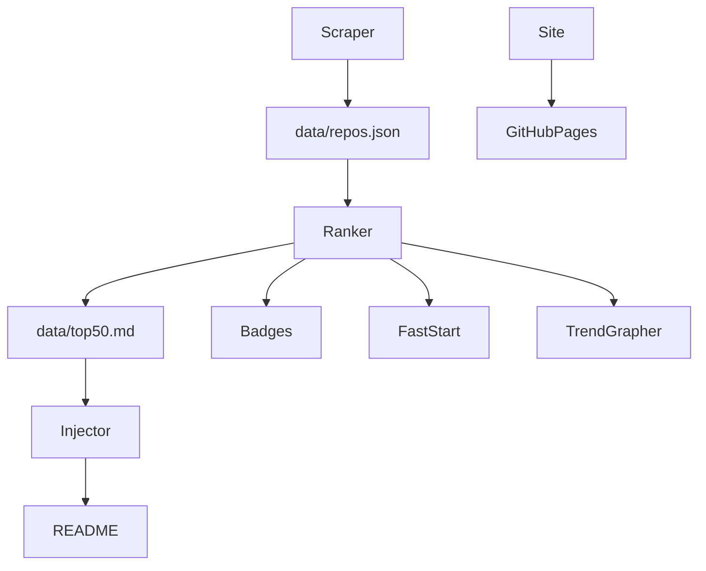

# Agents

## 1. Overview

AgentOps curates & ranks AI-agent repos so developers can quickly find reliable frameworks and tools.

## 2. Agents Table

| Agent Name | Trigger | Code Location | Main Function | Outputs |
|------------|---------|---------------|---------------|---------|
| ScraperCLI | manual / update.yml | `agentops_cli/scraper.py` | Fetch repos via GitHub API | `data/repos.json` |
| RankerCLI | manual / update.yml | `agentops_cli/ranker.py` | Compute score & top-50 | `data/top50.md`, badges |
| READMEInjector | pre-commit / update.yml | `agentops_cli/inject_readme.py` | Update README table | updated README |
| FastStartPicker | manual | `agentops_cli/faststart.py` | Generate FAST_START | `FAST_START.md` |
| TrendGrapher | update.yml | `agentops_cli/plot_trends.py` | Plot score trends | `docs/trends/*.png` |
| SiteDeployer | gh-pages | `.github/workflows/deploy_site.yml` | Publish /web to Pages | live site URL |

Add any new agents as you implement them.*

## 3. Agent Contracts

```yaml
name: ScraperCLI
inputs:
  - env: GITHUB_TOKEN
  - arg: --min-stars (int, optional)
outputs:
  - path: data/repos.json
success_criteria:
  - JSON schema valid
  - HTTP 200 for all API calls
```

```yaml
name: RankerCLI
inputs:
  - path: data/repos.json
outputs:
  - path: data/top50.md
  - path: badges/*
success_criteria:
  - top50.md contains a markdown table
  - badges are valid SVG
```

```yaml
name: READMEInjector
inputs:
  - path: data/top50.md
  - path: README.md
outputs:
  - path: README.md
success_criteria:
  - README contains updated table between markers
```

```yaml
name: FastStartPicker
inputs:
  - path: data/repos.json
  - arg: --top (int)
outputs:
  - path: FAST_START.md
success_criteria:
  - table has expected columns
```

```yaml
name: TrendGrapher
inputs:
  - path: data/top50.md history
outputs:
  - path: docs/trends/*.png
success_criteria:
  - PNG files created
```

```yaml
name: SiteDeployer
inputs:
  - path: web/*
outputs:
  - url: GitHub Pages site
success_criteria:
  - deployment job succeeds
```

## 4. Data Flow Diagram



## 5. Maintenance Notes

- To add a new agent, create a CLI module in `agentops_cli/` and document it in the table above.
- See [CONTRIBUTING.md](CONTRIBUTING.md) for guidelines.
