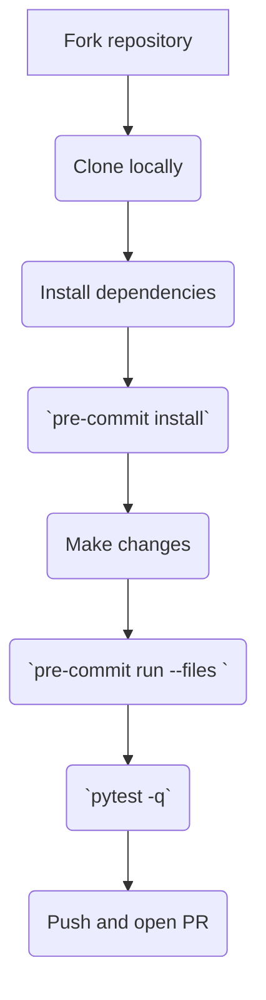

# Development Guide

This page explains how to set up a working environment for Agentic Index contributors.

## Workflow



## Common commands

```bash
# install runtime deps
pip install -r requirements.txt

# install the package in editable mode
pip install -e .

# set up hooks and run lint/tests automatically
pre-commit install

# run the full test suite
pytest -q
```

## Troubleshooting FAQ

**Q: Network errors when installing packages?**

Use the default PyPI mirror or the mirror in `docs/CI_SETUP.md` if your network blocks outbound HTTPS.

**Q: GitHub API rate limit when scraping?**

Export `GITHUB_TOKEN` with a personal token to increase limits or reduce the `--min-stars` argument when testing locally.

**Q: Paths not recognized on Windows?**

Run the tools in WSL or use forward slashes (e.g. `python scripts/inject_readme.py`).
