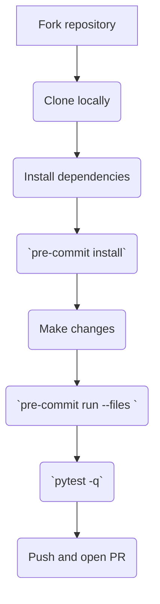

# Development Guide

See [ONBOARDING.md](./ONBOARDING.md) for full setup instructions. This file is kept for backward compatibility.

## Workflow



## Quick setup

Run the helper script to prepare your environment:

```bash
source scripts/setup-env.sh
```

The script verifies Python **3.11** or newer, installs required system packages,
creates a virtual environment with the pinned dependencies from
`requirements.lock`, exports `PYTHONPATH`, and installs pre-commit hooks. It also
loads any variables in a `.env` file or prompts for missing values such as API
keys.

## Troubleshooting FAQ

**Q: Network errors when installing packages?**

Use the default PyPI mirror or the mirror in `docs/CI_SETUP.md` if your network blocks outbound HTTPS.

**Q: GitHub API rate limit when scraping?**

Export `GITHUB_TOKEN_REPO_STATS` with a personal token to increase limits or reduce the `--min-stars` argument when testing locally.

**Q: Paths not recognized on Windows?**

Run the tools in WSL or use forward slashes (e.g. `python scripts/inject_readme.py`).

### README injection must be idempotent

Running `python scripts/inject_readme.py` twice in a row should leave `README.md`
unchanged. CI checks this with `pytest -k test_inject_idempotent`. If the second
run rewrites the file, adjust the injector so only the table body between the
`<!-- TOP50:START -->` and `<!-- TOP50:END -->` markers is regenerated.

Whenever `data/top100.md` or `data/repos.json` change, regenerate the README and
commit the updated files so `tests/test_inject_dry_run.py` stays in sync. The
test tolerates minor score drift (±0.01) but still fails if the table structure
diverges.

### IssueLogger

Use the `issue-logger` command to post a GitHub issue or comment from scripts or
CI pipelines.

```bash
python -m agentic_index_cli.issue_logger \
  --repo owner/repo --new-issue \
  --title "CI Failure" --body "See logs for details"
```

The tool reads a token from `GITHUB_TOKEN` or falls back to
`GITHUB_TOKEN_ISSUES`.

#### Examples

Create an issue and assign a user:

```bash
python -m agentic_index_cli.issue_logger \
  --repo owner/repo --new-issue --title "Bug" \
  --body "Details" --assign your-user --label bug --milestone 1
```

Update the body of issue #5:

```bash
python -m agentic_index_cli.issue_logger --update \
  --repo owner/repo --issue-number 5 --body "Updated text"
```

You can also target an existing issue directly with a full URL:

```bash
python -m agentic_index_cli.issue_logger --comment \
  --issue-url https://github.com/owner/repo/issues/5 \
  --body "Looks good!"
```

Pass `--debug` to print API calls or `--dry-run` to simulate without creating
anything.

