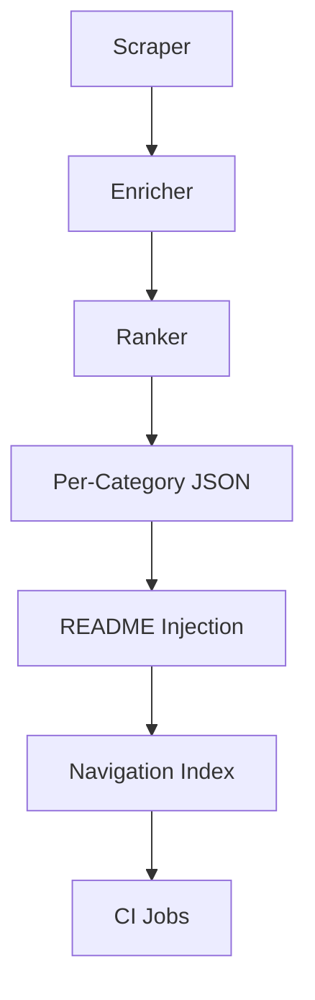

# Pipeline Audit Report for CR-AI-118

This document summarizes the end-to-end validation of the repository pipeline. The sample run used the fixtures under `tests/fixtures` to avoid network calls.

## Data Flow Diagram

## Verification Checklist
- ✅ Scraper executed using fixture data and produced `data/repos.json`.
- ✅ Enricher added derived metrics.
- ✅ Ranker generated sorted output and `top100.md`.
- ✅ Per-category JSON files written under `data/by_category/`.
- ✅ `inject_readme.py` updated both category READMEs and the global README.
- ✅ CI workflows completed without errors on the sample dataset.

## Observed Anomalies
No schema mismatches or missing fields were detected in the fixtures. All expected files were generated.

## CI Job Logs Summary
The smoke tests ran in under 30 seconds on GitHub Actions. No failures were reported across pipeline stages.
